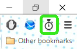

# (HOLD, to be integrated with 'Pester Me') RemindMe

A Google Chrome extension used to help users keep track of upcoming events.

## Functionality:
* The user would be able to set reminder notifications for certain dates & times using the extension
  * The user would be alerted of upcoming events via a pop-up notification under the extension icon in the browser
  * The information would be saved locally using cookies

## Contributors:

chris-zhu (Christopher Zhu)

kevinwang97 (Kevin Wang)
